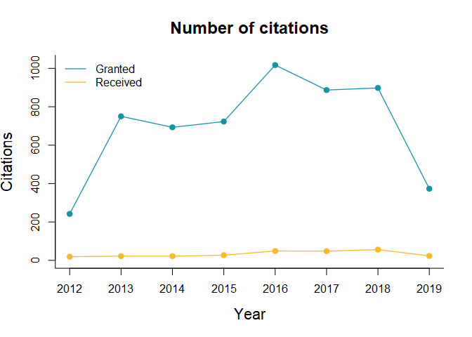

# rscielo

**Authors:** [Fernando Meireles](https://fmeireles.com/), [Denisson
Silva](http://denissonsilva.com/), and Rogerio Barbosa<br/>

[](https://travis-ci.org/meirelesff/rScielo)
[](https://ci.appveyor.com/project/meirelesff/rScielo)
[](http://www.gnu.org/licenses/gpl-2.0.html)
[](https://cran.r-project.org/package=rscielo)
[](https://www.tidyverse.org/lifecycle/#maturing)

`rscielo` provides functions to easily scrape bibliometric information
from scientific journals and articles hosted on the [Scientific
Electronic Library Online Platform (Scielo.br)](http://www.scielo.br/).
The retrieved data includes journal’s details and citation counts;
article’s contents, footnotes, bibliographic references; and many other
common information used in bibliometric studies The package also offers
functions to quickly summarize the scrapped data.

### Installing

To install the latest stable release of `rscielo` from
[CRAN](http://cran.r-project.org/), use:

``` r
install.packages("rscielo")
```

Alternatively, one may install the latest pre-release version from
[GitHub](https://github.com/) via:

``` r
if(!require("remotes")) install.packages("remotes")
remotes::install_github("meirelesff/rscielo")
```

### How does it work?

At its core, `rscielo` is a scraper that offers a transparent and
reprodutible approach to gather data from the [Scientific Electronic
Library Online Platform (Scielo.br)](http://www.scielo.br/), one of the
largest open repositories for scientific publications in the world. In
particular, the package provides several functions to automatically
extract and parse different types of information from (1) scientific
journals (pointed by `_journal` or `_journal_` in their names) and (2)
articles (with functions that contains `_article` or `_article_` in
their names).

### Journals

#### Getting a journal’s ID

To get data from an entire journal, such as citation counts and
[ISSN](https://en.wikipedia.org/wiki/International_Standard_Serial_Number),
the `rscielo` relies on an ID (or pid) that uniquely identifies each
journal within the [Scielo](http://www.scielo.br/)’s repository. As an
example, this is the URL of the [Brazilian Political Science
Review](http://www.scielo.br/bpsr/) homepage on
[Scielo](http://www.scielo.br/):

    http://www.scielo.br/scielo.php?script=sci_serial&pid=1981-3821&lng=en&nrm=iso

The journal’s ID can be found between `&pid=` and `&lng` (i.e.,
`1981-3821`). Most `rscielo`’s functions that retrive data from journals
rely on this argument to work. To automatically extract an ID from the
URL of a journal, one may use the `get_journal_id()`
function:

``` r
get_journal_id("http://www.scielo.br/scielo.php?script=sci_serial&pid=1981-3821&lng=en&nrm=iso")
#> [1] "1981-3821"
```

#### Scraping data from a journal

With a journal’s ID in hand, to scrape meta-data from all articles in
the last issue of a journal use the `get_journal()` function:

``` r
df <- get_journal("1981-3821")
```

The code returns a `tibble` in which all articles in the last issue of a
journal are the observations. Among the returned variables are authors’
names, institutional affiliations, and home countries; articles’s
abstracts, keywords, and number of pages (check the `get_journal`
documentation with `help(get_journal)` for a full description of the
retrieved data).

For a quick glimpse in the scrapped data, one may use the `summary`
method:

``` r
summary(df)
#> 
#> ### JOURNAL: Brazilian Political Science Review
#> 
#> 
#>  Total number of articles:  9 
#>  Total number of articles (reviews excluded):  7
#> 
#>  Mean number of authors per article:  2 
#>  Mean number of pages per article:  Not available
```

Finally, `get_journal()` also extracts data from all articles ever
published by a journal. To do that, just set the argument `last_issue`
to `FALSE`:

``` r
get_journal("1981-3821", last_issue = "FALSE")
```

#### Scraping journal metrics

`rscielo` also provides functions to scrape and report publication and
citation counts of a journal:

``` r
# Gets citation metrics
cit <- get_journal_metrics("1981-3821")

# Plots the data for a quick visualization
plot(cit)
```

<!-- -->

#### Other information

`get_journal_info()` and `get_journal_list()` scrapes a journal’s
meta-information (publisher, ISSN, and mission) and a list of all
journals hosted on [Scielo](http://www.scielo.br/), respectively:

``` r
# Get a journal's meta-information
meta_info <- get_journal_info("1981-3821")

# Get a list with all journals names, URLs and IDs
journals <- get_journal_list()
```

### Articles

#### Getting an articles’ ID

The `rscielo` also contains a function to scrape meta-data from a single
article:

``` r
# The article's URL on Scielo
url <- "http://www.scielo.br/scielo.php?script=sci_arttext&pid=S1981-38212016000200201&lng=en&nrm=iso&tlng=en"

# Scrape the data
article <- get_article(url)
```

### A list of functions

For convinience, here is a description of the `rScielo` functions:

  - `get_id_journal()`: Gets a journal’s ID from its url.
  - `get_journal()`: Gets meta-data from all articles published by a
    journal.
  - `get_article()`: Gets meta-data from a single article.
  - `get_journal_info()`: Gets a journal’s description.
  - `get_journal_list()`: Gets a list with all journals’ names, URLs and
    ID’s.
  - `get_journal_metrics()`: Gets publication and citation metrics of a
    journal.
